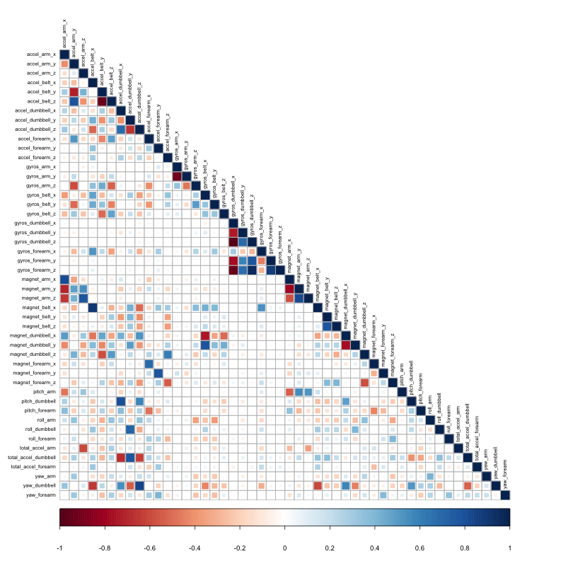

```{r setup}
library(caret)
library(rpart)
library(rpart.plot)
library(rattle)
library(randomForest)
library(corrplot)
set.seed(666)
```

In this project, I will predict the manner, in which an exercise was executed (A, B, C, D, or E) - the "classe"-variable.

## First, we have to read in the data.

```{r DataReadIn, eval=FALSE, message=FALSE, echo=TRUE}

train_pml0 <- read.csv("./pml-training.csv", header = TRUE, na.strings = c("NA", ""))

test_pml <- read.csv("./pml-testing.csv", header = TRUE, na.strings = c("NA", ""))

load("ML_data.RData")
```

Having read in the data, we need to do some data cleaning first (it is important to remember to apply the same steps to the testing set later!!).

### 1. For prediction, we will first have to inspect the variables to find out which ones are useful.

`str(train_pml)` reveals that there are several variables that are set to factor, while they actually appear to have numeric values. We find that some variables are indeed useless (`levels(train_pml$kurtosis_yaw_belt)`), while others have a wide range of numberic values.

```{r, echo=FALSE, message=FALSE, eval=FALSE, error=FALSE, warning=FALSE}

for (i in colnames(train_pml0[ ,sapply(train_pml0, class) == "factor"])) {
  print(i)
  print(levels(train_pml0[[i]]))
}
```

The outout of the *for loop* shows us which variables are truly useless. They will now be removed.

```{r, echo=TRUE, message=FALSE, eval=FALSE}
vars <- c(
  "X", "user_name", "raw_timestamp_part_1", "raw_timestamp_part_2",
  "kurtosis_yaw_belt", "skewness_yaw_belt", "amplitude_yaw_belt", "cvtd_timestamp",
  "kurtosis_yaw_dumbbell", "skewness_yaw_dumbbell", "amplitude_yaw_dumbbell",
  "kurtosis_yaw_forearm", "skewness_yaw_forearm", "amplitude_yaw_forearm")

train_pml <- train_pml0[, -which(names(train_pml0) %in% vars)]

```

Now, we convert the factor variables to numberic

```{r, echo=TRUE, message=FALSE, eval=FALSE}

vars_fact <- c(
  "kurtosis_roll_belt", "kurtosis_picth_belt", "skewness_roll_belt",
  "skewness_roll_belt.1", "max_yaw_belt", "min_yaw_belt",
  "kurtosis_roll_arm","kurtosis_picth_arm", "kurtosis_yaw_arm",
  "skewness_roll_arm","skewness_pitch_arm", "skewness_yaw_arm",
  "kurtosis_roll_dumbbell", "kurtosis_picth_dumbbell","skewness_roll_dumbbell",
  "skewness_pitch_dumbbell","max_yaw_dumbbell", "min_yaw_dumbbell",
  "kurtosis_roll_forearm","kurtosis_picth_forearm", "skewness_roll_forearm",
  "skewness_pitch_forearm", "max_yaw_forearm", "min_yaw_forearm")

for (v in vars_fact) {
  train_pml[[v]] <- as.numeric(as.character(train_pml[[v]]))
}

```

Since there are still a lot of variables (146), we will further reduce the number of variables

The near zero variance (NZV) variables are also removed and the ID variables as well.

```{r, echo=TRUE, message=FALSE, eval=TRUE}
NZV <- nearZeroVar(train_pml)
train_pml <- train_pml[,-NZV]
dim(train_pml)
```

We are now down to 119 variables. Onto, removing variables that are mostly NA

```{r, echo=TRUE, message=FALSE, eval=FALSE}

data_NA   <- sapply(train_pml, function(x) mean(is.na(x))) > 0.95
train_pml <- train_pml[, data_NA==FALSE]

dim(train_pml)
```

Finally, we remove variables only used for identification (vars 1:5)
```{r, echo=TRUE, message=FALSE, eval=FALSE}
library(dplyr)
train_pml <- select(train_pml, -c(1:5))

dim(train_pml)
```
And we are down to 49 variables total to be used in our analysis.

### 2. Data sets and exploratory data analysis

First, we break the *train_pml* dataset up into a train and a validation set.

```{r, echo=TRUE, eval=FALSE, message=FALSE}
set.seed(666)
inTrain <- createDataPartition(train_pml$classe, p = 0.7, list = FALSE)

train <- train_pml[inTrain,]
validation <- train_pml[-inTrain,]
```
Let's see which variables are strongly correlated.

```{r, echo=TRUE, message=FALSE, eval=FALSE}

cor_matrix <- cor(train[,-49])
corrplot(cor_matrix, order = "alphabet", method = "square", type = "lower", tl.cex = 0.6, tl.col = rgb(0,0,0))
```



Since there are only a few strong correlations, PCA will not be applied and I will move forward with the train and validation datasets

## 3. Model building

Three ML methods will be applied: Random forest, a generalized boosted model, and a decision tree model. Finally, all three models will be combined to see if their combination produces even better results.

### Random forest

```{r, random forest, eval=FALSE, message=FALSE, echo=TRUE}
set.seed(666) # for reproducability

rf_control <- trainControl(method = "cv", number = 3, verboseIter = FALSE) # crossvalidation will be used

mod_rf <- train(classe ~ ., data = train, method = "rf", trControl = rf_control)

mod_rf$finalModel

```

Prediction on validation set

```{r, RF val, eval=FALSE, message=FALSE, echo=TRUE}

predict_rf <- predict(mod_rf, newdata=validation)
conf_mat_rf <- confusionMatrix(predict_rf, validation$classe)
conf_mat_rf
```

### Generalized boosted model

```{r, GBM val, eval=FALSE, message=FALSE, echo=TRUE}

gbm_control <- trainControl(method = "repeatedcv", number = 5, repeats = 1) # repeated crossvalidation
mod_gbm <- train(classe ~ ., data = validation, method = "gbm", trControl = gbm_control, verbose = FALSE)

mod_gbm$finalModel
```

Prediction on validation set

```{r, GBM pred, eval=FALSE, message=FALSE, echo=TRUE}

predict_gbm <- predict(mod_gbm, newdata=validation)
conf_mat_gbm <- confusionMatrix(predict_gbm, validation$classe)
conf_mat_gbm
```

### Decision tree model

```{r, eval = FALSE, echo=TRUE, include= TRUE}

mod_dt <- rpart(classe ~ ., data = train, method = "class")

fancyRpartPlot(mod_dt, main = "Decision Tree", sub = "Classe ~ all vars")
```

Prediction on validation set

```{r, dt predict, eval = FALSE, message=FALSE, echo=TRUE}

predict_dt <- predict(mod_dt, newdata=validation, type="class")
conf_mat_dt <- confusionMatrix(predict_dt, validation$classe)
conf_mat_dt
```

### 4. Outcome

We can see that the Random Forest outperforms both the gbm and the decision tree in terms of accuracy (0.9893 vs. 0.9602, and 0.6658 respectively) - the latter performs worst.

### 5. Applying mod_rf to our testing set

The Random Forest model will be applied to predict the 20 quiz results (testing dataset):

```{r, quiz prediction, eval=FALSE, message=FALSE, echo=TRUE}
predict_test <- predict(mod_rf, newdata=test_pml)
predict_test
```
